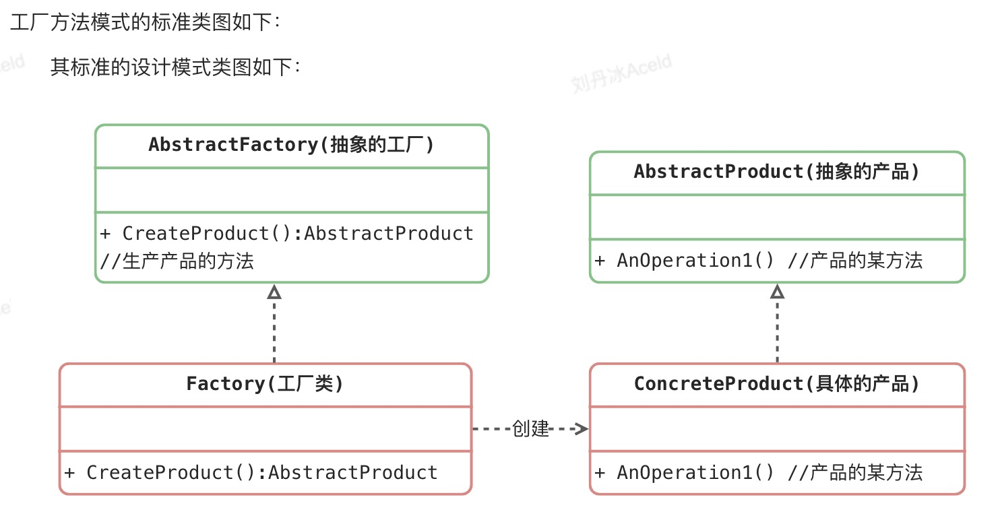

#### 工厂方法
工厂方法模式是一种创建型设计模式， 其在父类中提供一个创建对象的方法， 允许子类决定实例化对象的类型。

工厂方法模式建议使用特殊的工厂方法代替对于对象构造函数的直接调用 （即使用 new运算符）。

乍看之下， 这种更改可能毫无意义： 我们只是改变了程序中调用构造函数的位置而已。 但是， 仔细想一下， 现在你可以在子类中重写工厂方法， 从而改变其创建产品的类型。

但有一点需要注意:仅当这些产品具有共同的基类或者接口时， 子类才能返回不同类型的产品， 同时基类中的工厂方法还应将其返回类型声明为这一共有接口。

##### 工厂方法模式中的角色和职责
抽象工厂（Abstract Factory）角色：工厂方法模式的核心，任何工厂类都必须实现这个接口。
工厂（Concrete Factory）角色：具体工厂类是抽象工厂的一个实现，负责实例化产品对象。
抽象产品（Abstract Product）角色：工厂方法模式所创建的所有对象的父类，它负责描述所有实例所共有的公共接口。
具体产品（Concrete Product）角色：工厂方法模式所创建的具体实例对象。

简单工厂模式  + “开闭原则” =    工厂方法模式

#### 工厂方法模式的优缺点
优点： 
- 不需要记住具体类名，甚至连具体参数都不用记忆。 
- 实现了对象创建和使用的分离。 
- 系统的可扩展性也就变得非常好，无需修改接口和原类。 
- 对于新产品的创建，符合开闭原则。

缺点： 
- 增加系统中类的个数，复杂度和理解度增加。 
- 增加了系统的抽象性和理解难度。

适用场景： 
- 客户端不知道它所需要的对象的类。 
- 抽象工厂类通过其子类来指定创建哪个对象。
