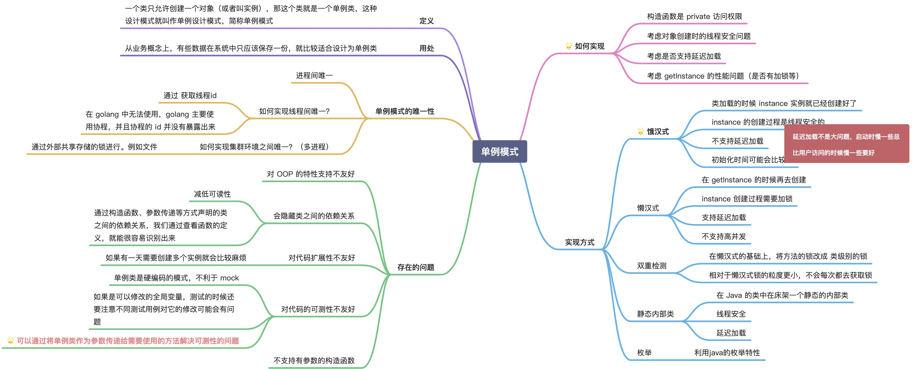

单例模式是一种创建型设计模式， 让你能够保证一个类只有一个实例， 并提供一个访问该实例的全局节点。

单例模式要解决的问题是：
保证一个类永远只能有一个对象，且该对象的功能依然能被其他模块使用。


单例模式解决了两个问题， 但违反了单一职责原则：
- 保证一个类只有一个实例
- 为该实例提供一个全局访问节点

所有单例的实现都包含以下两个相同的步骤：
1. 将默认构造函数设为私有， 防止其他对象使用单例类的 new运算符。
2. 新建一个静态构建方法作为构造函数。 该函数会 “偷偷” 调用私有构造函数来创建对象， 并将其保存在一个静态成员变量中。 此后所有对于该函数的调用都将返回这一缓存对象。

单例实例singleton被保存为一个私有的变量，以保证不被其他包的函数引用。


饿汉式的实现，简单，并且可以将问题及早暴露.
懒汉式虽然支持延迟加载，但是这只是把冷启动时间放到了第一次使用的时候，并没有本质上解决问题，并且为了实现懒汉式还不可避免的需要加锁。

在初始化单例唯一指针的时候，就已经提前开辟好了一个对象，申请了内存。
饿汉式的好处是，不会出现线程并发创建，导致多个单例的出现，但是缺点是如果这个单例对象在业务逻辑没有被使用，也会客观的创建一块内存对象。
那么与之对应的模式叫懒汉式。

饿汉模式

```
type Singleton struct {
}

var eagerSingleton *Singleton

func init() {
    eagerSingleton = &Singleton{}
}

func GetEagerInstance() *Singleton {
    return eagerSingleton
}
```


懒汉模式
```
var (
    lazySingleton *Singleton
    once          = &sync.Once{}
)

func GetLazyInstance() *Singleton {
    if lazySingleton == nil {
        once.Do(func() {
            lazySingleton = &Singleton{}
        })
    }
    return lazySingleton
}
```

```
// 构造方法，用于获取单例模式对象,单锁定
func GetInstance(v int) Singleton {
    once.Do(func() {
       lazySingleton = &Singleton{}
    })
  return lazySingleton
}
```

测试文件
```
func TestGetInstance(t *testing.T) {
	assert.Equal(t, GetEagerInstance(), GetLazyInstance())
}

func BenchmarkGetInstanceParallel(b *testing.B) {
	b.RunParallel(func(pb *testing.PB) {
		for pb.Next() {
			if GetEagerInstance() != GetEagerInstance() {
				b.Errorf("test fail")
			}
		}
	})
}

func BenchmarkGetLazyInstanceParallel(b *testing.B) {
	b.RunParallel(func(pb *testing.PB) {
		for pb.Next() {
			if GetLazyInstance() != GetLazyInstance() {
				b.Errorf("test fail")
			}
		}
	})
}
```

```
//启动命令
go test -benchmem -bench="." -v
```

跑benchmark的情况下，还是饿汉模式快
init方式初始化，比new的性能效果要好


##### 优缺点
###### 优点：
(1) 单例模式提供了对唯一实例的受控访问。
(2) 节约系统资源。由于在系统内存中只存在一个对象。

###### 缺点：
(1) 扩展略难。单例模式中没有抽象层。
(2) 单例类的职责过重。   


##### 适用场景
(1) 系统只需要一个实例对象，如系统要求提供一个唯一的序列号生成器或资源管理器，或者需要考虑资源消耗太大而只允许创建一个对象。
(2) 客户调用类的单个实例只允许使用一个公共访问点，除了该公共访问点，不能通过其他途径访问该实例。
